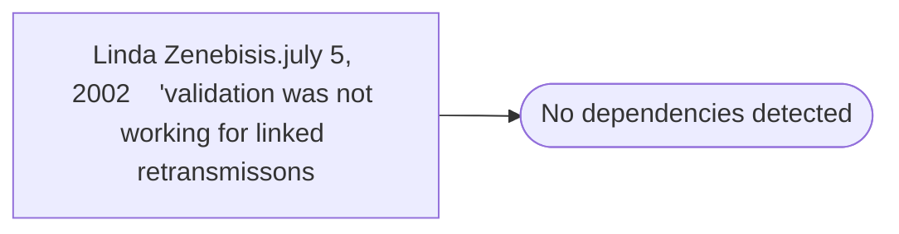

# Linda Zenebisis.july 5, 2002    'validation was not working for linked retransmissons

**Database:** smartlook_01  
**Server:** bedrockdb02  

## Architecture Diagram



## Table Dependencies

_No table references detected._

## Stored Procedure Code

```sql

```

