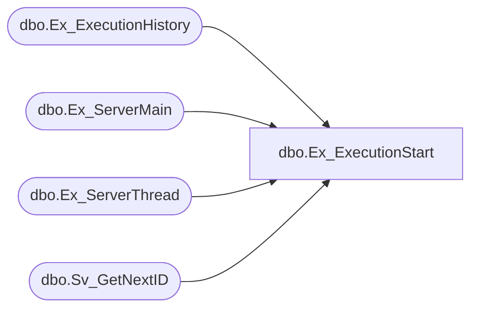

# dbo.Ex_ExecutionStart

**Database:** smartlook_01  
**Server:** bedrockdb02  

## Architecture Diagram



## Table Dependencies

| Referenced Table |
|---|
| dbo.Ex_ExecutionHistory |
| dbo.Ex_ServerMain |
| dbo.Ex_ServerThread |
| dbo.Sv_GetNextID |

## Stored Procedure Code

```sql

```

