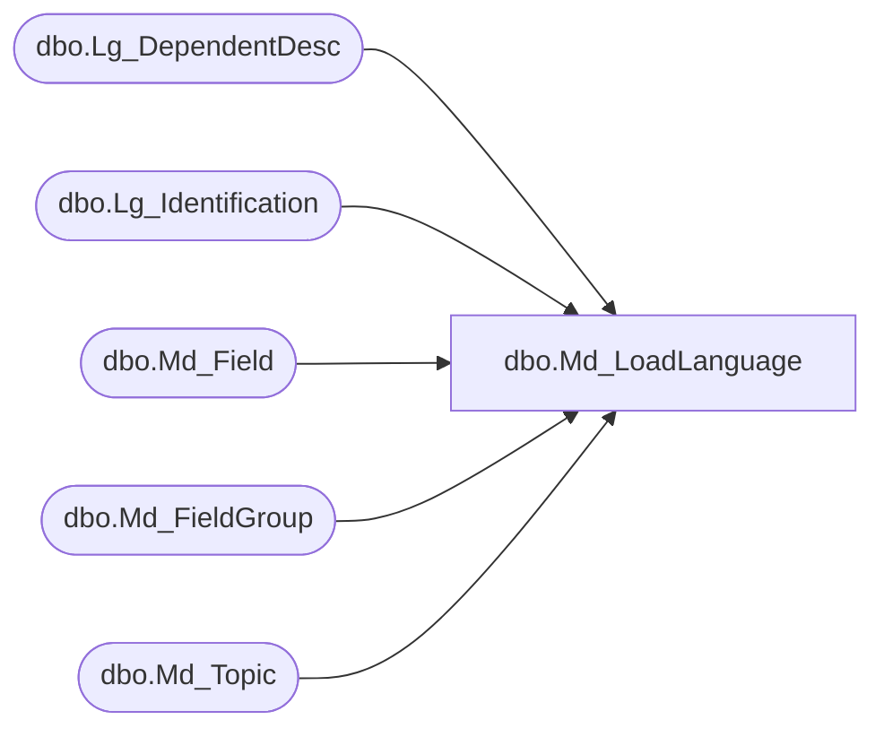

# dbo.Md_LoadLanguage

**Database:** smartlook_01  
**Server:** bedrockdb02  

## Architecture Diagram



## Table Dependencies

| Referenced Table |
|---|
| dbo.Lg_DependentDesc |
| dbo.Lg_Identification |
| dbo.Md_Field |
| dbo.Md_FieldGroup |
| dbo.Md_Topic |

## Stored Procedure Code

```sql

```

