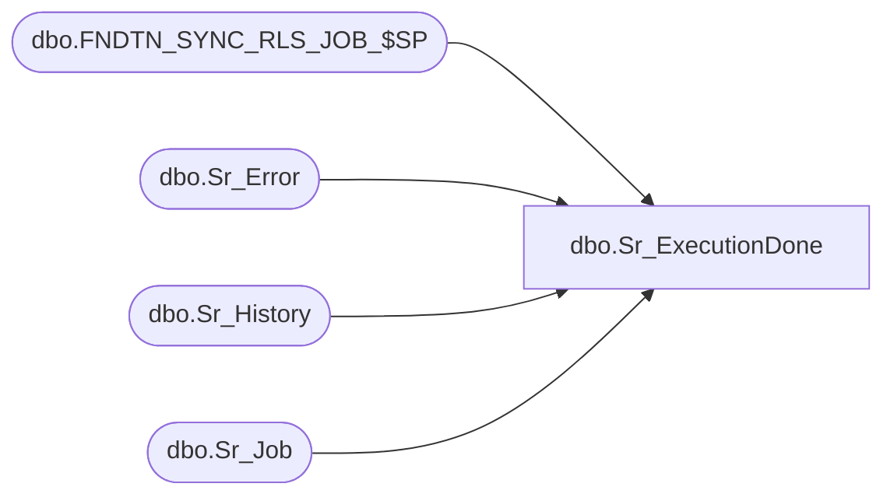

# dbo.Sr_ExecutionDone

**Database:** smartlook_01  
**Server:** bedrockdb02  

## Architecture Diagram



## Table Dependencies

| Referenced Table |
|---|
| dbo.FNDTN_SYNC_RLS_JOB_$SP |
| dbo.Sr_Error |
| dbo.Sr_History |
| dbo.Sr_Job |

## Stored Procedure Code

```sql
create proc Sr_ExecutionDone @JobID int, @ExecutionID int, @ExitCode int, @Locked int, @Parent_job_id int, @NextDateTime varchar(60)
```

