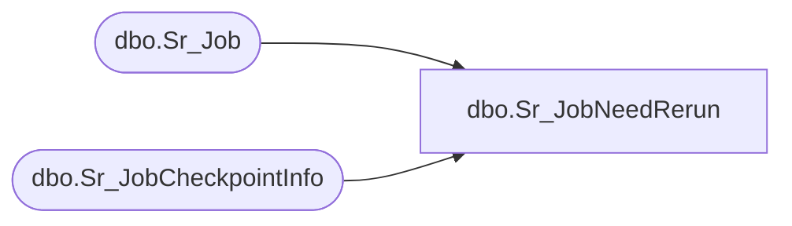

# dbo.Sr_JobNeedRerun

**Database:** smartlook_01  
**Server:** bedrockdb02  

## Architecture Diagram



## Table Dependencies

| Referenced Table |
|---|
| dbo.Sr_Job |
| dbo.Sr_JobCheckpointInfo |

## Stored Procedure Code

```sql

```

