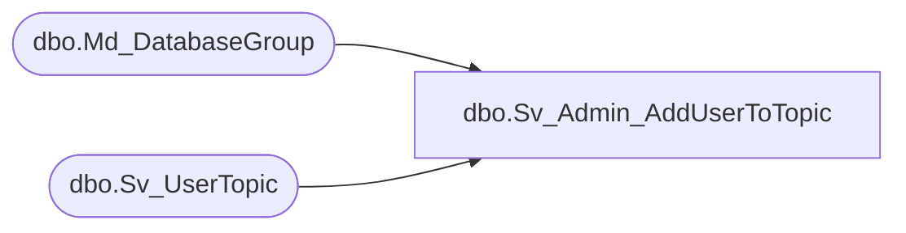

# dbo.Sv_Admin_AddUserToTopic

**Database:** smartlook_01  
**Server:** bedrockdb02  

## Architecture Diagram



## Table Dependencies

| Referenced Table |
|---|
| dbo.Md_DatabaseGroup |
| dbo.Sv_UserTopic |

## Stored Procedure Code

```sql

```

