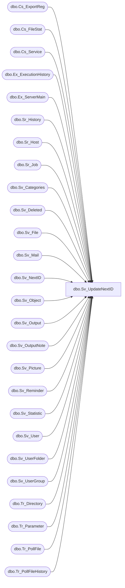

# dbo.Sv_UpdateNextID

**Database:** smartlook_01  
**Server:** bedrockdb02  

## Architecture Diagram



## Table Dependencies

| Referenced Table |
|---|
| dbo.Cs_ExportReg |
| dbo.Cs_FileStat |
| dbo.Cs_Service |
| dbo.Ex_ExecutionHistory |
| dbo.Ex_ServerMain |
| dbo.Sr_History |
| dbo.Sr_Host |
| dbo.Sr_Job |
| dbo.Sv_Categories |
| dbo.Sv_Deleted |
| dbo.Sv_File |
| dbo.Sv_Mail |
| dbo.Sv_NextID |
| dbo.Sv_Object |
| dbo.Sv_Output |
| dbo.Sv_OutputNote |
| dbo.Sv_Picture |
| dbo.Sv_Reminder |
| dbo.Sv_Statistic |
| dbo.Sv_User |
| dbo.Sv_UserFolder |
| dbo.Sv_UserGroup |
| dbo.Tr_Directory |
| dbo.Tr_Parameter |
| dbo.Tr_PollFile |
| dbo.Tr_PollFileHistory |

## Stored Procedure Code

```sql

```

