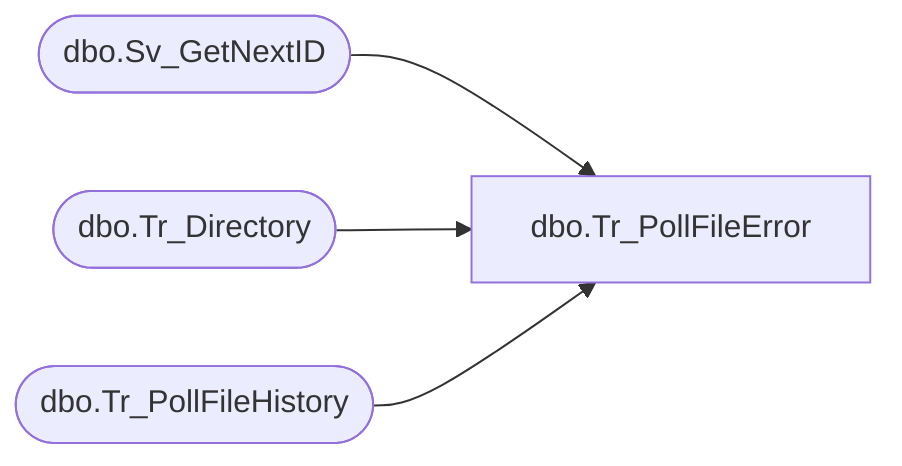

# dbo.Tr_PollFileError

**Database:** smartlook_01  
**Server:** bedrockdb02  

## Architecture Diagram



## Table Dependencies

| Referenced Table |
|---|
| dbo.Sv_GetNextID |
| dbo.Tr_Directory |
| dbo.Tr_PollFileHistory |

## Stored Procedure Code

```sql

```

