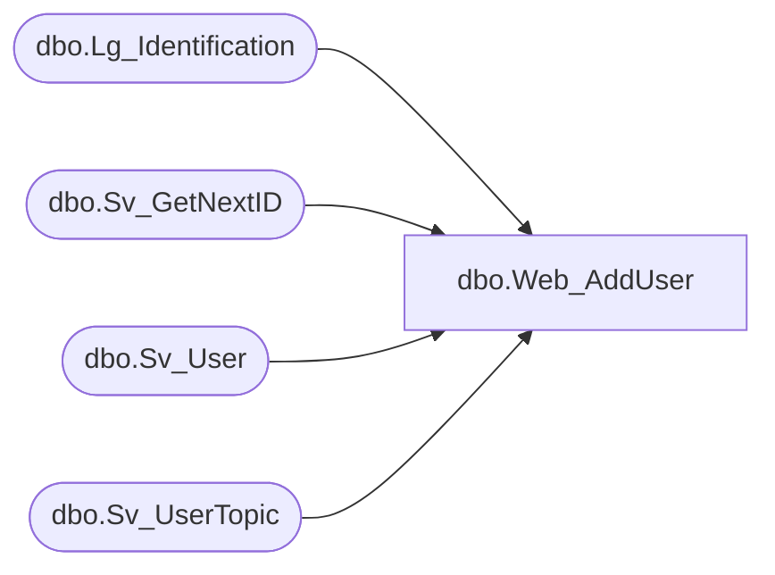

# dbo.Web_AddUser

**Database:** smartlook_01  
**Server:** bedrockdb02  

## Architecture Diagram



## Table Dependencies

| Referenced Table |
|---|
| dbo.Lg_Identification |
| dbo.Sv_GetNextID |
| dbo.Sv_User |
| dbo.Sv_UserTopic |

## Stored Procedure Code

```sql

```

