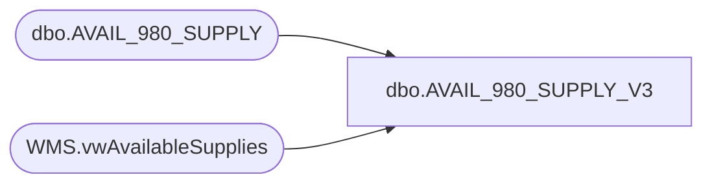

# dbo.AVAIL_980_SUPPLY_V3

**Database:** DBAUtility  
**Server:** bedrockdb02  

## Architecture Diagram



## Table Dependencies

| Referenced Table |
|---|
| dbo.AVAIL_980_SUPPLY |
| WMS.vwAvailableSupplies |

## View Code

```sql
CREATE VIEW [dbo].[AVAIL_980_SUPPLY_V3]
AS
SELECT *
FROM 
(
	SELECT style FROM 
	[WMDB01].[WMPROD].[dbo].[AVAIL_980_SUPPLY]
	EXCEPT
	SELECT ItemNumber AS style
	FROM [STL-SSIS-P-01].IntegrationStaging.WMS.vwAvailableSupplies
	WHERE InventoryWarehouseId IN ('9980')-- AND AvailableOnHandQuantity > 0
) AS innerQry
UNION
SELECT ItemNumber AS style
FROM [STL-SSIS-P-01].IntegrationStaging.WMS.vwAvailableSupplies
WHERE InventoryWarehouseId IN ('9980') AND AvailableOnHandQuantity > 0
```

