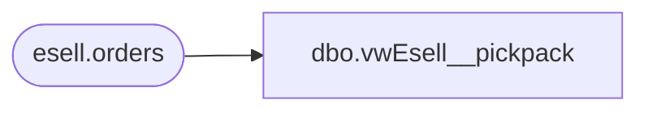

# dbo.vwEsell__pickpack

**Database:** DBAUtility  
**Server:** bedrockdb02  

## Architecture Diagram



## Table Dependencies

| Referenced Table |
|---|
| esell.orders |

## View Code

```sql
/****** Script for SelectTopNRows command from SSMS  ******/
CREATE VIEW [dbo].[vwEsell__pickpack] AS
SELECT sub.order_id, sub.transition_seq, e.current_state, e.event_timestamp FROM 
	(SELECT esell.[order_id] ,MAX(transition_seq) AS transition_seq
	FROM [esell].[esell].[orders] esell
	GROUP BY order_id) sub
	LEFT JOIN esell.esell.orders e ON sub.order_id = e.order_id AND sub.transition_seq = e.transition_seq
	WHERE order_type = 'pickup'
	AND current_state = 'Pick/Pack'
	AND DATEADD(DAY,7,event_timestamp) <= GETDATE()


dbo,vwEsell_OrderCustomerData,create view vwEsell_OrderCustomerData

as

WITH
OrderTransition (order_id, transition_seq)
as 
	(
		select order_id, max(transition_seq) transition_seq
		from esell.esell.orders
		group by order_id
   ),
BillingCustomer 
as
	(
		select 
			o.order_id,
			c.customer_id,
			c.first_name,
			c.last_name,
			c.day_phone,
			c.evening_phone,
			c.email
		from esell.esell.customer c
		join esell.esell.orders o on c.order_id = o.order_id
		join OrderTransition ot on o.order_id = ot.order_id and o.transition_seq = ot.transition_seq
		where c.cust_type = 'BILL'
	),
FulfillCustomer 
as
	(
		select 
			o.order_id,
			c.customer_id,
			c.first_name,
			c.last_name,
			c.day_phone,
			c.evening_phone,
			c.email
		from esell.esell.customer c
		join esell.esell.orders o on c.order_id = o.order_id
		join OrderTransition ot on o.order_id = ot.order_id and o.transition_seq = ot.transition_seq
		where c.cust_type = 'FULFILL-0'
	)
select
	b.order_id,
	b.customer_id BillingCustomerID,
	b.first_name BillingFirstName,
	b.last_name BillingLastName,
	b.day_phone BillingDayPhone,
	b.evening_phone BillingEveningPhone,
	b.email BillingEmail,
	f.customer_id FulfillmentCustomerID,
	f.first_name FulfillmentFirstName,
	f.last_name FulfillmentLastName,
	f.day_phone FulfillmentDayPhone,
	f.evening_phone FulfillmentEveningPhone,
	f.email FulfillmentEmail
from 
	BillingCustomer b
join FulfillCustomer f on b.order_id = f.order_id
```

