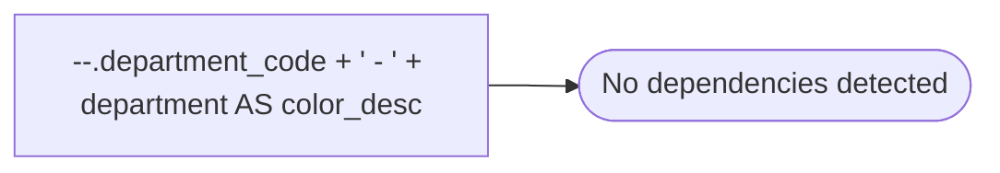

# --.department_code + ' - ' + department AS color_desc

**Database:** dw_mirror  
**Server:** bedrockdb02  

## Architecture Diagram



## Table Dependencies

_No table references detected._

## View Code

```sql

```

