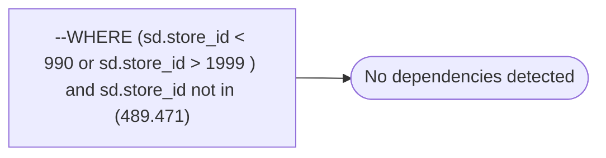

# --WHERE (sd.store_id < 990 or sd.store_id > 1999 ) and sd.store_id not in (489.471)

**Database:** dw_mirror  
**Server:** bedrockdb02  

## Architecture Diagram



## Table Dependencies

_No table references detected._

## View Code

```sql

```

