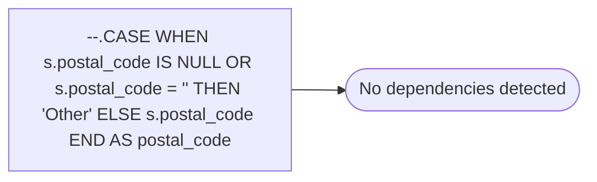

# --.CASE WHEN s.postal_code IS NULL OR s.postal_code = '' THEN 'Other' ELSE s.postal_code END AS postal_code

**Database:** dw_mirror  
**Server:** bedrockdb02  

## Architecture Diagram



## Table Dependencies

_No table references detected._

## View Code

```sql

```

