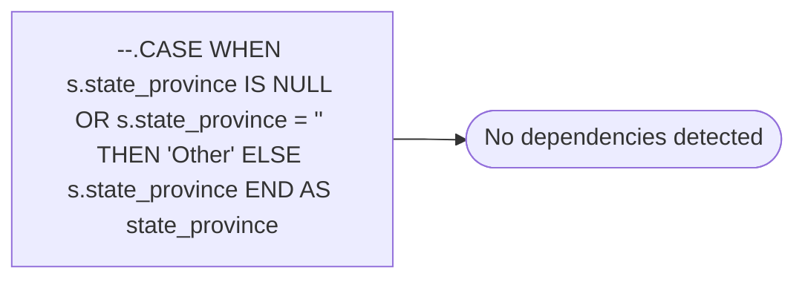

# --.CASE WHEN s.state_province IS NULL OR s.state_province = '' THEN 'Other' ELSE s.state_province END AS state_province

**Database:** dw_mirror  
**Server:** bedrockdb02  

## Architecture Diagram



## Table Dependencies

_No table references detected._

## View Code

```sql

```

