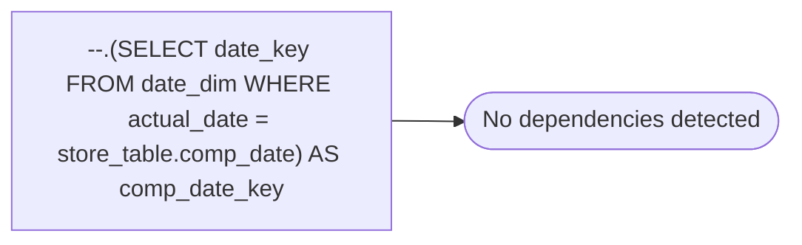

# --.(SELECT date_key FROM date_dim WHERE actual_date = store_table.comp_date) AS comp_date_key

**Database:** dw_mirror  
**Server:** bedrockdb02  

## Architecture Diagram



## Table Dependencies

_No table references detected._

## View Code

```sql

```

