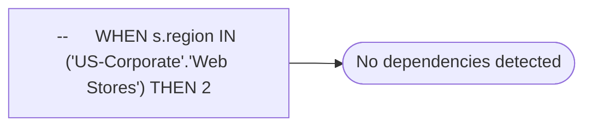

# --	WHEN s.region IN ('US-Corporate'.'Web Stores') THEN 2

**Database:** dw_mirror  
**Server:** bedrockdb02  

## Architecture Diagram



## Table Dependencies

_No table references detected._

## View Code

```sql

```

