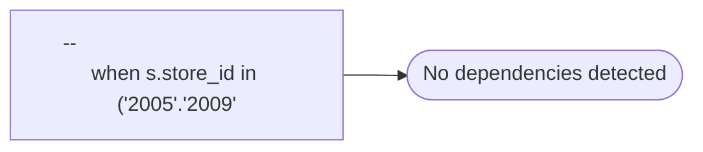

# --					when s.store_id in ('2005'.'2009'

**Database:** dw_mirror  
**Server:** bedrockdb02  

## Architecture Diagram



## Table Dependencies

_No table references detected._

## View Code

```sql
'2013'
```

