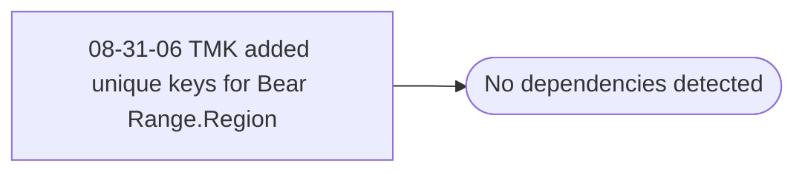

# 08-31-06 TMK added unique keys for Bear Range.Region

**Database:** dw_mirror  
**Server:** bedrockdb02  

## Architecture Diagram



## Table Dependencies

_No table references detected._

## View Code

```sql
and Bearitory
```

