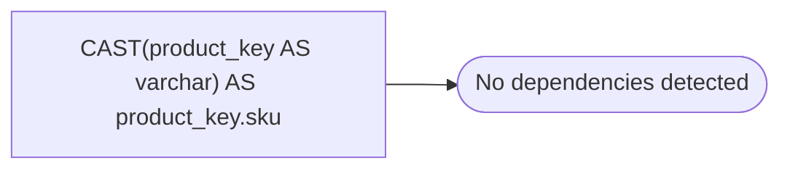

# CAST(product_key AS varchar) AS product_key.sku

**Database:** dw_mirror  
**Server:** bedrockdb02  

## Architecture Diagram



## Table Dependencies

_No table references detected._

## View Code

```sql
activation_date
```

