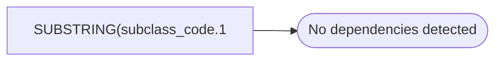

# SUBSTRING(subclass_code.1

**Database:** dw_mirror  
**Server:** bedrockdb02  

## Architecture Diagram



## Table Dependencies

_No table references detected._

## View Code

```sql
LEN(subclass_code) - 3) AS product_key
```

