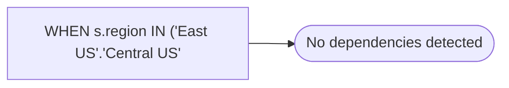

# WHEN s.region IN ('East US'.'Central US'

**Database:** dw_mirror  
**Server:** bedrockdb02  

## Architecture Diagram



## Table Dependencies

_No table references detected._

## View Code

```sql
'West'
```

