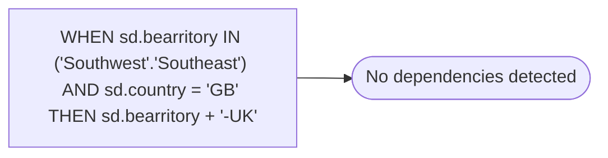

# WHEN sd.bearritory IN ('Southwest'.'Southeast') AND sd.country = 'GB' THEN sd.bearritory + '-UK'

**Database:** dw_mirror  
**Server:** bedrockdb02  

## Architecture Diagram



## Table Dependencies

_No table references detected._

## View Code

```sql

```

