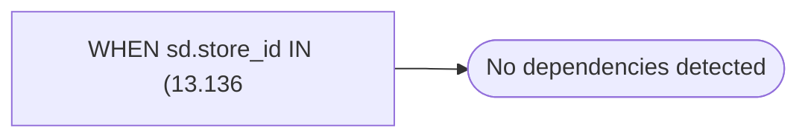

# WHEN sd.store_id IN (13.136

**Database:** dw_mirror  
**Server:** bedrockdb02  

## Architecture Diagram


```mermaid
flowchart LR
    VIEW["WHEN sd.store_id IN (13.136"]
    VIEW --> NoRefs(["No dependencies detected"])
```

## Table Dependencies

_No table references detected._

## View Code

```sql
473
```

