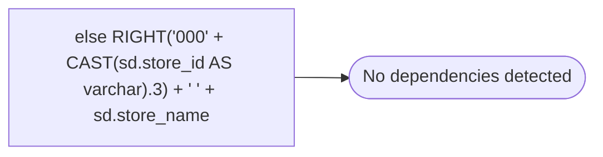

# else RIGHT('000' + CAST(sd.store_id AS varchar).3) + ' ' + sd.store_name

**Database:** dw_mirror  
**Server:** bedrockdb02  

## Architecture Diagram



## Table Dependencies

_No table references detected._

## View Code

```sql

```

