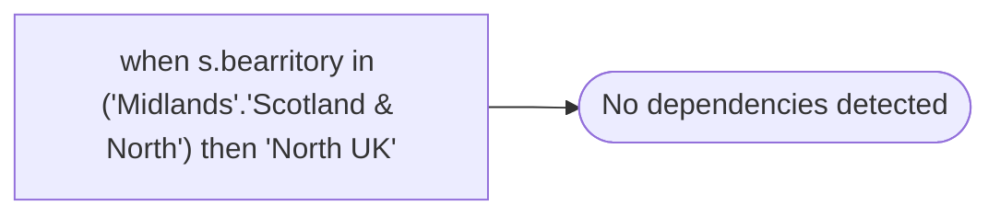

# when s.bearritory in ('Midlands'.'Scotland & North') then 'North UK'

**Database:** dw_mirror  
**Server:** bedrockdb02  

## Architecture Diagram



## Table Dependencies

_No table references detected._

## View Code

```sql

```

