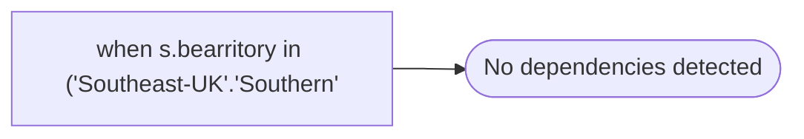

# when s.bearritory in ('Southeast-UK'.'Southern'

**Database:** dw_mirror  
**Server:** bedrockdb02  

## Architecture Diagram



## Table Dependencies

_No table references detected._

## View Code

```sql
'Southwest-UK') then 'South UK'
```

