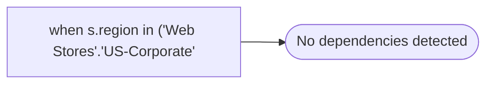

# when s.region in ('Web Stores'.'US-Corporate'

**Database:** dw_mirror  
**Server:** bedrockdb02  

## Architecture Diagram



## Table Dependencies

_No table references detected._

## View Code

```sql
'Canada-Corporate'
```

