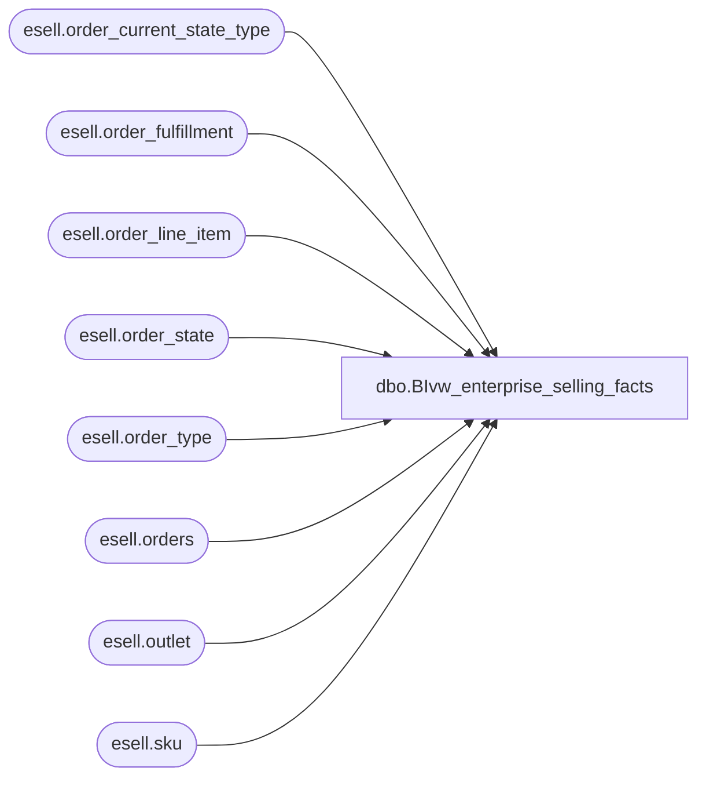

# dbo.BIvw_enterprise_selling_facts

**Database:** esell  
**Server:** bedrockdb02  

## Architecture Diagram



## Table Dependencies

| Referenced Table |
|---|
| esell.order_current_state_type |
| esell.order_fulfillment |
| esell.order_line_item |
| esell.order_state |
| esell.order_type |
| esell.orders |
| esell.outlet |
| esell.sku |

## View Code

```sql
CREATE view [dbo].[BIvw_enterprise_selling_facts]
as

	select distinct 
		o.order_id order_id,
		ot.order_type_name order_type,
		ocst.state_desc order_status,
		o.current_state,
		o.transition_seq,
		replace(o.order_id, 'U', '') reference_number,
		cast( right(ou1.outlet_id, 4) as int) order_location,
		substring(replace(o.order_id, 'U', ''), 10, 2) pos_register_number,
		substring(replace(o.order_id, 'U', ''), 12, 5) pos_transaction_number,
		cast( right(ou2.outlet_id, 4) as int) fulfillment_location,
		li.line_item_number,
		sku.product_id style,
		li.quantity_ordered,
		--o.order_date order_create_date,
		cast(cast(o.order_date as date) as datetime) order_create_date,
		datepart(hh, o.order_date) order_create_hour,
		datepart(mi, o.order_date) order_create_minute,
		--o.event_timestamp order_status_date
		cast(cast(o.event_timestamp as date) as datetime) order_status_date,
		datepart(hh, o.event_timestamp) order_status_hour,
		datepart(mi, o.event_timestamp) order_status_minute
	from esell.orders o with (nolock) 
	join esell.order_type ot with (nolock) on o.order_type = ot.order_type
	join esell.order_state os with (nolock) on o.current_state = os.order_state
	join esell.order_current_state_type ocst with (nolock) on os.state_id = ocst.state_id
	join esell.order_line_item li with (nolock) on o.order_id = li.order_id and o.transition_seq = li.transition_seq
	join esell.sku with (nolock) on li.sku_id = sku.sku_id
	join esell.order_fulfillment f with (nolock) on o.order_id = f.order_id and o.transition_seq = f.transition_seq
	join esell.outlet ou1 with (nolock) on o.selling_outlet_id = ou1.outlet_id
	join esell.outlet ou2 with (nolock) on f.fulfill_outlet_id = ou2.outlet_id

 

dbo,nsb_db_install,CREATE VIEW [dbo].[nsb_db_install] (execution_id, install_id, original_filename, generated_by, executed_by, execution_date, execution_status, application_name) AS SELECT execution_id, install_id, original_filename, generated_by, executed_by, execution_date, execution_status, application_name FROM [dbo].[db_install]
dbo,nsb_db_install_detail,CREATE VIEW [dbo].[nsb_db_install_detail] (execution_id, module_id, object_version_id, object_name, object_type_name, execution_status, error_message) AS SELECT execution_id, module_id, object_version_id, object_name, object_type_name, execution_status, error_message FROM [dbo].[db_install_detail]
dbo,nsb_db_install_module,CREATE VIEW [dbo].[nsb_db_install_module] (execution_id, module_id, module_name, from_release_no, from_build_no, to_release_no, to_build_no, execution_status) AS SELECT execution_id, module_id, module_name, from_release_no, from_build_no, to_release_no, to_build_no, execution_status FROM [dbo].[db_install_module]
```

