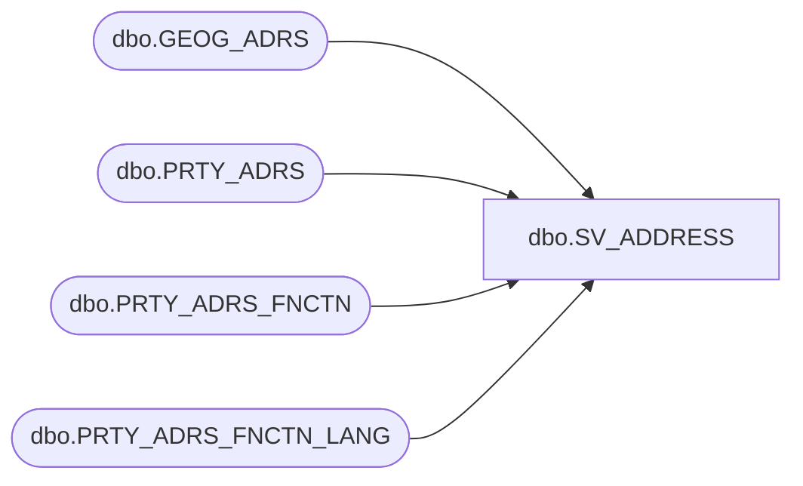

# dbo.SV_ADDRESS

**Database:** esell  
**Server:** bedrockdb02  

## Architecture Diagram



## Table Dependencies

| Referenced Table |
|---|
| dbo.GEOG_ADRS |
| dbo.PRTY_ADRS |
| dbo.PRTY_ADRS_FNCTN |
| dbo.PRTY_ADRS_FNCTN_LANG |

## View Code

```sql
CREATE VIEW [dbo].[SV_ADDRESS]
AS
SELECT
  a.PRTY_ID,  a.ADRS_ID, a.PRTY_ADRS_SEQ, 
  g.ADRS_LINE_1, g.ADRS_LINE_2, g.ADRS_LINE_3, g.ADRS_LINE_4, g.CITY, g.POST_CODE, g.TRTRY_CODE, 
  g.CNTRY_CODE_ISO3, a.EFCTV_STRT_DATE, 
  a.EFCTV_END_DATE, a.ADRS_EXPRTN_RSN_ID, a.PRTY_ADRS_DESC, 
  a.ADRS_FNCTN_CODE, COALESCE(l.ADRS_FNCTN_DESC, f.ADRS_FNCTN_DESC) AS ADRS_FNCTN_DESC, 
  COALESCE(l.ADRS_FNCTN_SHRT_DESC, f.ADRS_FNCTN_SHRT_DESC) AS ADRS_FNCTN_SHRT_DESC, 
  COALESCE(l.LANG_ID, 1033) AS LANG_ID 
FROM PRTY_ADRS a 
  INNER JOIN PRTY_ADRS_FNCTN f ON (a.ADRS_FNCTN_CODE = f.ADRS_FNCTN_CODE)
  LEFT JOIN PRTY_ADRS_FNCTN_LANG l ON (f.ADRS_FNCTN_CODE = l.ADRS_FNCTN_CODE)
  INNER JOIN GEOG_ADRS g ON (a.ADRS_ID = g.ADRS_ID)
WHERE a.EFCTV_STRT_DATE < GETDATE()
AND (a.EFCTV_END_DATE >= GETDATE() OR a.EFCTV_END_DATE IS NULL)
```

