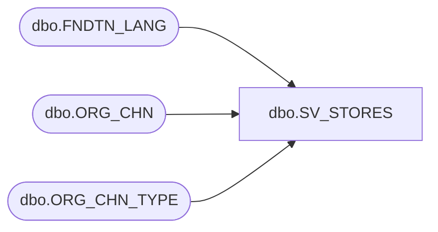

# dbo.SV_STORES

**Database:** esell  
**Server:** bedrockdb02  

## Architecture Diagram



## Table Dependencies

| Referenced Table |
|---|
| dbo.FNDTN_LANG |
| dbo.ORG_CHN |
| dbo.ORG_CHN_TYPE |

## View Code

```sql
create view [dbo].[SV_STORES] 
AS
SELECT o.ORG_CHN_NUM ,
       o.ORG_CHN_NAME,
       o.ORG_CHN_SHRT_NAME ,
       o.ORG_CHN_TYPE_CODE,
       ISNULL(f.LANG_DESC, CONVERT(VARCHAR,o.PRMRY_LANG_ID)) AS PRMRY_LANG,
       o.PRMRY_LANG_ID,
       o.PRTY_ID,
       o.AUTO_ACPT,
       o.GMT_OFST,
       o.GL_CMPNY_NUM,
       o.GL_LOC_NUM,
       o.USE_AS_TMPLT,
       o.TMPLT_DESC,
       o.COMP_DATE,
       o.OPEN_TO_RCV_DATE,
       o.OPEN_DATE,
       o.CLS_DATE,
       o.ACTV,
       o.STLMNT_BLNG_NAME,
       o.MD_PRMTR_TBL_NUM,
       o.VCHR_CNFG_TYPE,
       o.TAX_JRSDCTN_CODE,
       o.PRMRY_BANK_ACNT_ID,
       o.OPEN_HOUR_ID,
       t.SYS_CODE,
       t.ORG_CHN_TYPE_SHRT_DESC 
FROM ORG_CHN o
     INNER JOIN ORG_CHN_TYPE t ON (o.ORG_CHN_TYPE_CODE = t.ORG_CHN_TYPE_CODE)
     LEFT JOIN FNDTN_LANG f ON (o.PRMRY_LANG_ID = f.LANG_ID)
WHERE SYS_CODE IN ('CTLG', 'STR', 'WEB', 'WSTR')
dbo,vwDW_EnterpriseSellingOrderTransitions,create VIEW vwDW_EnterpriseSellingOrderTransitions


as 

--==================================================================================================
--	Author			Date			Details
--	Dan Tweedie		02/02/2017		Shows Enterprise Selling orders, order transition status datetimes
--==================================================================================================


WITH 
Masters as --substrings are based on reference_number / order_id map provided by Megan 
	(
		select  
			o.order_id master_order_id,
			o.order_date,
			substring(replace(o.order_id, 'U', ''), 0, (len(replace(o.order_id, 'U', '')) -2)) order_number, -- excludes beginning U
			max(transition_seq) max_transition_seq,
			ot.order_type_name master_order_type
		from 
				esell.esell.orders o with (nolock)
		join	esell.esell.order_type ot with (nolock) on o.order_type = ot.order_type
		where 
			o.current_state = 'Master'
		group by 
			o.order_id,
			o.order_date,
			ot.order_type_name 
	)
select
		m.order_date as OrderCreateDateTime,
		m.order_number OrderNumber,
		m.master_order_type OrderType,
		right(ou1.outlet_id, 4) OrderStoreNumber,
		right(ou2.outlet_id, 4) FulfillmentStoreNumber,
		o.current_state CurrentState,
		ocst.state_desc OrderStatus,
		o.transition_seq TransitionSequence,
		o.event_timestamp TransitionDateTime
	from 
			esell.esell.orders o with (nolock)
	join	Masters m 
		on left(o.order_id, len(o.order_id)-2) = left(m.master_order_id, len(m.master_order_id)-2)
		and o.order_id <> m.master_order_id
	join	esell.esell.order_type ot with (nolock) 
		on o.order_type = ot.order_type
	join esell.esell.order_state os with (nolock) 
		on o.current_state = os.order_state
	join esell.esell.order_current_state_type ocst with (nolock) 
		on os.state_id = ocst.state_id
	join esell.esell.order_fulfillment f with (nolock) 
		on o.order_id = f.order_id 
		and o.transition_seq = f.transition_seq
	join esell.esell.outlet ou1 with (nolock) 
		on o.selling_outlet_id = ou1.outlet_id
	left join esell.esell.outlet ou2 with (nolock) 
		on f.fulfill_outlet_id = ou2.outlet_id
```

