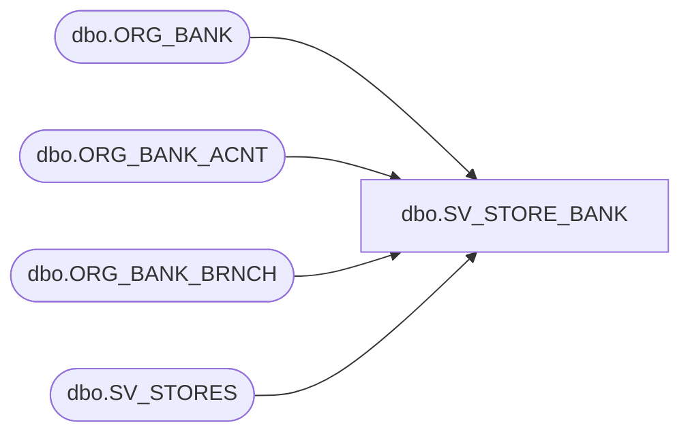

# dbo.SV_STORE_BANK

**Database:** esell  
**Server:** bedrockdb02  

## Architecture Diagram



## Table Dependencies

| Referenced Table |
|---|
| dbo.ORG_BANK |
| dbo.ORG_BANK_ACNT |
| dbo.ORG_BANK_BRNCH |
| dbo.SV_STORES |

## View Code

```sql
create view [dbo].[SV_STORE_BANK] AS 
SELECT o.ORG_CHN_NUM, o.PRMRY_BANK_ACNT_ID, b.BANK_SHRT_NAME, c.BANK_BRNCH_SHRT_NAME, BANK_BRNCH_NUM,
b.INSTN_NUM, a.BANK_ACNT_NUM, a.BANK_ACNT_DESC, a.GL_RFRNC_NUM
FROM SV_STORES o      
LEFT OUTER JOIN ORG_BANK b
on o.PRMRY_BANK_ACNT_ID = b.BANK_ID
LEFT join ORG_BANK_BRNCH c
ON b.BANK_ID = c.BANK_ID
LEFT JOIN ORG_BANK_ACNT a
ON c.BANK_BRNCH_ID = a.BANK_BRNCH_ID
AND c.BANK_ID = c.BANK_ID
```

