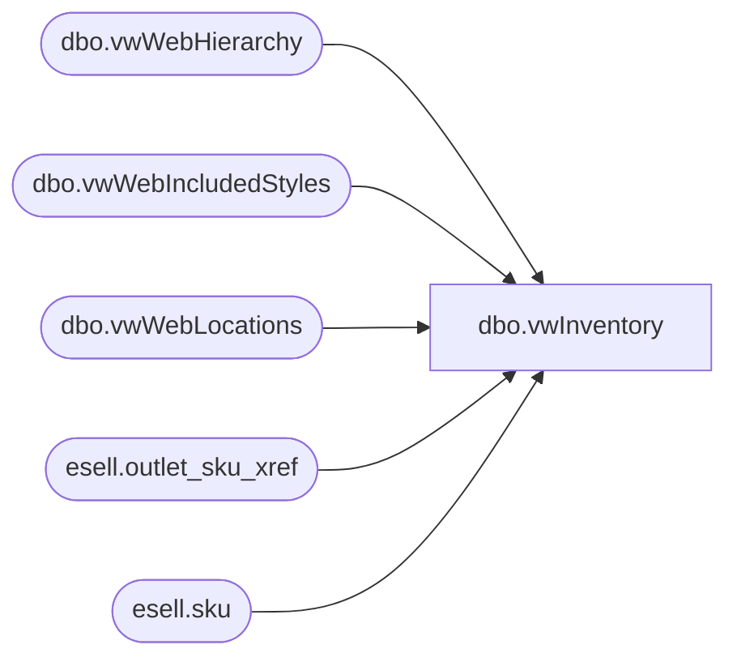

# dbo.vwInventory

**Database:** esell  
**Server:** bedrockdb02  

## Architecture Diagram



## Table Dependencies

| Referenced Table |
|---|
| dbo.vwWebHierarchy |
| dbo.vwWebIncludedStyles |
| dbo.vwWebLocations |
| esell.outlet_sku_xref |
| esell.sku |

## View Code

```sql
CREATE view [dbo].[vwInventory]

as

--------------------------------------------------------------------------------------------------
-- vwInventory - Captures inventory for ecommerce integration
--- 2017-05-04 - Dan Tweedie - Created View
--------------------------------------------------------------------------------------------------

WITH 
Locations as
	(
		select
			Code as LocationCode
		from me_01.dbo.vwWebLocations
	),
Styles as
	(
		select 
			s.style_code StyleCode,
			cast(s.SKUDescription as varchar(120)) as SKUDescription,
			cast(s.UPC as varchar(20)) as UPC, 
			case 
				when h.SubClassCode in 
					(
						'W-C-K-12-01-07',
						'W-D-K-12-01-07',
						'W-E-K-12-01-07',
						'W-F-K-12-01-07'
					) then 'DigitalBlanks'
				when h.SubClassCode in 
					(
						'R-B-D-80-02-00',
						'R-B-U-80-02-00'
					) then 'VirtualGiftCards' 
				else 'PhysicalProduct'
			end as ProductType
		from me_01.dbo.vwWebIncludedStyles s
		join me_01.dbo.vwWebHierarchy h on s.hierarchy_group_id = h.SubClassHierarchyGroupID
		where s.StorefrontEligible = 1
	),
StyleLocation as
	(
		select
			s.StyleCode,
			s.SKUDescription,
			s.UPC,
			s.ProductType,
			l.LocationCode
		from Styles s
		cross join Locations l
	),
Inventory as
	(
		select 
			l.LocationCode,
			s.StyleCode,
			s.ProductType,
			cast(sum(x.qty) as int) as Qty
		from esell.outlet_sku_xref x with (nolock)
		join esell.sku sku with (nolock) on x.sku_id = sku.sku_id
		join Locations l on right(x.outlet_id, 4) = l.LocationCode
		join Styles s on cast(sku.product_id as varchar(6)) = s.StyleCode
		group by 
			l.LocationCode,
			s.StyleCode,
			s.ProductType
	),
Stage as
	(
		select 
			sl.StyleCode,
			sl.SKUDescription,
			sl.UPC,
			sl.LocationCode,
			case 
				when sl.ProductType in ('DigitalBlanks', 'VirtualGiftCards') and sl.LocationCode in ('0013','2013')
				then 10000 
				else cast(sum(isnull(i.Qty,0)) as int) 
			end as QTY
		from StyleLocation sl
		left join Inventory i on sl.StyleCode = i.StyleCode and sl.LocationCode = i.LocationCode
		group by 
			sl.StyleCode,
			sl.SKUDescription,
			sl.UPC,
			sl.LocationCode,
			sl.ProductType
	)
select 
	StyleCode,
	SKUDescription,
	UPC,
	LocationCode,
	Qty
from Stage
where Qty > 0

----------------------------------------------------------
--WITH 
--Locations as
--	(
--		select
--			Code as LocationCode
--		from me_01.dbo.vwWebLocations
--	),
--Styles as
--	(
--		select 
--			s.style_code StyleCode,
--			cast(s.SKUDescription as varchar(120)) as SKUDescription,
--			cast(s.UPC as varchar(20)) as UPC, 
--			case 
--				when h.SubClassCode in 
--					(
--						'W-C-K-12-01-07',
--						'W-D-K-12-01-07',
--						'W-E-K-12-01-07',
--						'W-F-K-12-01-07'
--					) then 'DigitalBlanks'
--				when h.SubClassCode in 
--					(
--						'R-B-D-80-02-00',
--						'R-B-U-80-02-00'
--					) then 'VirtualGiftCards' 
--				else 'PhysicalProduct'
--			end as ProductType
--		from me_01.dbo.vwWebIncludedStyles s
--		join me_01.dbo.vwWebHierarchy h on s.hierarchy_group_id = h.SubClassHierarchyGroupID
--		where s.StorefrontEligible = 1
--	)
--select 
--	l.LocationCode,
--	s.UPC,
--	s.StyleCode,
--	s.SKUDescription,
--	isnull(
--			case 
--				when s.ProductType in ('DigitalBlanks', 'VirtualGiftCards') 
--				then 10000 
--				else cast(sum(x.qty) as int) 
--			end,
--		0) as QTY
--from esell.outlet_sku_xref x with (nolock)
--join esell.sku sku with (nolock) on x.sku_id = sku.sku_id
--join Locations l on right(x.outlet_id, 4) = l.LocationCode
--join Styles s on cast(sku.product_id as varchar(6)) = s.StyleCode
--group by 
--	l.LocationCode,
--	s.UPC,
--	s.StyleCode,
--	s.SKUDescription,
--	s.ProductType 


esell,vwInventoryWebView,create view esell.vwInventoryWebView

as

select x.sku_id, cast(right(x.outlet_id, 4) as varchar(4)) as LocationCode, cast(sum(x.qty) as int) as QTY
from esell.outlet_sku_xref x with (nolock)
group by x.sku_id, cast(right(x.outlet_id, 4) as varchar(4))
```

