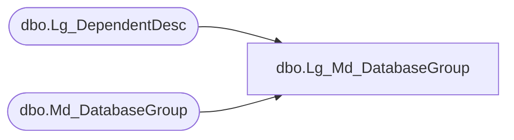

# dbo.Lg_Md_DatabaseGroup

**Database:** fn_01  
**Server:** bedrockdb02  

## Architecture Diagram



## Table Dependencies

| Referenced Table |
|---|
| dbo.Lg_DependentDesc |
| dbo.Md_DatabaseGroup |

## View Code

```sql
CREATE  view dbo.Lg_Md_DatabaseGroup  AS
	SELECT a.db_group_id, db_group_label_1, db_group_label_2, ISNULL(b.first_pair_text, db_group_label_1) as db_group_label_3, 
	       db_group_description_1, db_group_description_2, ISNULL(b.second_pair_text, db_group_description_1) as db_group_description_3, 
	       data_source_name, user_name, user_password, vdb_name, topic_id, file_dsn_info, server_name, group_type, 
	       a.resource_id, sec_company_id, b.language_id
	  FROM Md_DatabaseGroup a LEFT OUTER JOIN Lg_DependentDesc b
	    ON a.resource_id = b.resource_id
```

