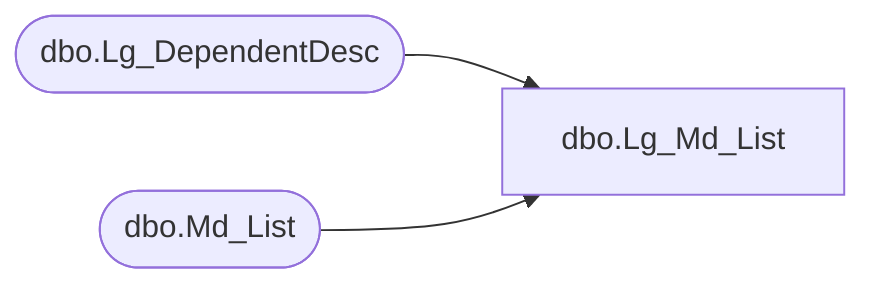

# dbo.Lg_Md_List

**Database:** fn_01  
**Server:** bedrockdb02  

## Architecture Diagram



## Table Dependencies

| Referenced Table |
|---|
| dbo.Lg_DependentDesc |
| dbo.Md_List |

## View Code

```sql
create view dbo.Lg_Md_List  AS
	SELECT a.list_id, a.list_label_1, a.list_label_2, ISNULL(b.first_pair_text, a.list_label_1) as list_label_3,
	       a.list_description_1, a.list_description_2, ISNULL(b.second_pair_text, a.list_description_1) as list_description_3,
	       a.order_method, a.display_method, a.resource_id, b.language_id
	  FROM Md_List a LEFT OUTER JOIN Lg_DependentDesc b ON a.resource_id = b.resource_id
```

