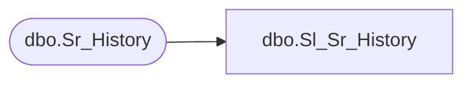

# dbo.Sl_Sr_History

**Database:** fn_01  
**Server:** bedrockdb02  

## Architecture Diagram



## Table Dependencies

| Referenced Table |
|---|
| dbo.Sr_History |

## View Code

```sql
CREATE VIEW [dbo].[Sl_Sr_History] (execution_id,job_id,server_id,thread_index,topic_id,db_group_id,object_id,include_in_average,start_datetime,end_datetime,duration,sucessful,exit_code,parent_job_id,machine_id,trace)
AS SELECT execution_id,job_id,server_id,thread_index,topic_id,db_group_id,object_id,include_in_average,start_datetime,end_datetime,duration,sucessful,exit_code,parent_job_id,machine_id,trace
FROM fn_01.dbo.Sr_History
```

