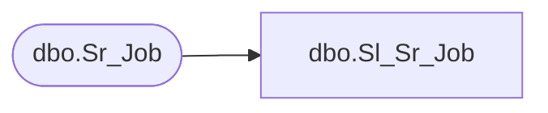

# dbo.Sl_Sr_Job

**Database:** fn_01  
**Server:** bedrockdb02  

## Architecture Diagram



## Table Dependencies

| Referenced Table |
|---|
| dbo.Sr_Job |

## View Code

```sql
CREATE VIEW [dbo].[Sl_Sr_Job] (job_id,server_id,sequence_number,topic_id,object_id,object_type,db_group_id,interval_count,interval_type,start_date_time,end_date_time,schedule_details,last_date_time,next_date_time,locked,scheduled_executions,done_executions,auto_execute,execution_id,active,avg_duration,label,cmd_line,cmd_line_parameters,data,previous_status,next_job_id,debug_level,created_date_time,scheduling_mode,max_threads,job_flags,machine_id,pid,data_ext,compatibility_version,wizard_id,kill_job)
AS SELECT job_id,server_id,sequence_number,topic_id,object_id,object_type,db_group_id,interval_count,interval_type,start_date_time,end_date_time,schedule_details,last_date_time,next_date_time,locked,scheduled_executions,done_executions,auto_execute,execution_id,active,avg_duration,label,cmd_line,cmd_line_parameters,data,previous_status,next_job_id,debug_level,created_date_time,scheduling_mode,max_threads,job_flags,machine_id,pid,data_ext,compatibility_version,wizard_id,kill_job
FROM fn_01.dbo.Sr_Job
```

