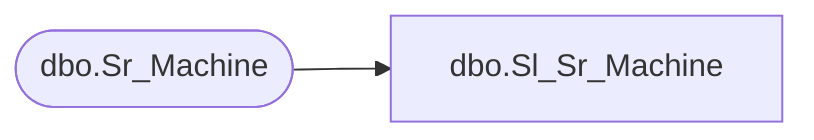

# dbo.Sl_Sr_Machine

**Database:** fn_01  
**Server:** bedrockdb02  

## Architecture Diagram



## Table Dependencies

| Referenced Table |
|---|
| dbo.Sr_Machine |

## View Code

```sql
CREATE VIEW [dbo].[Sl_Sr_Machine] (machine_id,machine_name,status,execution_id,any_job,hostname,install_path,daemon_tcp_port,requested_status,machine_version,host_id)
AS SELECT machine_id,machine_name,status,execution_id,any_job,hostname,install_path,daemon_tcp_port,requested_status,machine_version,host_id
FROM fn_01.dbo.Sr_Machine
```

