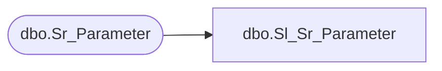

# dbo.Sl_Sr_Parameter

**Database:** fn_01  
**Server:** bedrockdb02  

## Architecture Diagram



## Table Dependencies

| Referenced Table |
|---|
| dbo.Sr_Parameter |

## View Code

```sql
create view  [dbo].[Sl_Sr_Parameter] (tag,tag_value,last_modified)
AS SELECT tag,tag_value,last_modified
FROM fn_01.dbo.Sr_Parameter
```

