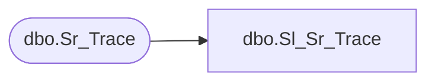

# dbo.Sl_Sr_Trace

**Database:** fn_01  
**Server:** bedrockdb02  

## Architecture Diagram



## Table Dependencies

| Referenced Table |
|---|
| dbo.Sr_Trace |

## View Code

```sql
create view  [dbo].[Sl_Sr_Trace] (trace_id,execution_id,exe_name,class_name,function_name,message,indent_level,trace_datetime,extended_message,severity)
AS SELECT trace_id,execution_id,exe_name,class_name,function_name,message,indent_level,trace_datetime,extended_message,severity
FROM fn_01.dbo.Sr_Trace
```

