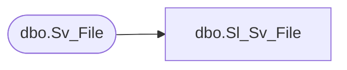

# dbo.Sl_Sv_File

**Database:** fn_01  
**Server:** bedrockdb02  

## Architecture Diagram



## Table Dependencies

| Referenced Table |
|---|
| dbo.Sv_File |

## View Code

```sql
create view  [dbo].[Sl_Sv_File] AS
SELECT file_id, file_sequence, file_data
FROM   fn_01.dbo.Sv_File
```

