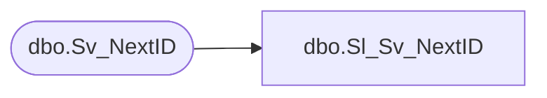

# dbo.Sl_Sv_NextID

**Database:** fn_01  
**Server:** bedrockdb02  

## Architecture Diagram



## Table Dependencies

| Referenced Table |
|---|
| dbo.Sv_NextID |

## View Code

```sql
create view  [dbo].[Sl_Sv_NextID] 
(table_id, table_name, next_id, max_id)
AS SELECT table_id, table_name, next_id, max_id
FROM fn_01.dbo.Sv_NextID
```

