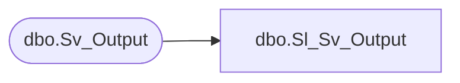

# dbo.Sl_Sv_Output

**Database:** fn_01  
**Server:** bedrockdb02  

## Architecture Diagram



## Table Dependencies

| Referenced Table |
|---|
| dbo.Sv_Output |

## View Code

```sql
create view  [dbo].[Sl_Sv_Output] 
(
	output_id, 
	object_id, 
	object_type, 
	execution_date, 
	page_count, 
	printed_count, 
	previewed_count, 
	expires, 
	db_group_id, 
	query_label
)
AS SELECT 
	output_id, 
	object_id, 
	object_type, 
	execution_date, 
	page_count, 
	printed_count, 
	previewed_count, 
	expires, 
	db_group_id, 
	query_label
FROM fn_01.dbo.Sv_Output
```

