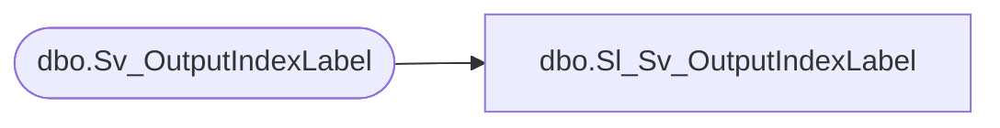

# dbo.Sl_Sv_OutputIndexLabel

**Database:** fn_01  
**Server:** bedrockdb02  

## Architecture Diagram



## Table Dependencies

| Referenced Table |
|---|
| dbo.Sv_OutputIndexLabel |

## View Code

```sql
create view  [dbo].[Sl_Sv_OutputIndexLabel] (
       	output_id, 
       	index_field_id, 
       	label 
)
AS SELECT 
       	output_id, 
       	index_field_id, 
       	label 
FROM fn_01.dbo.Sv_OutputIndexLabel
```

