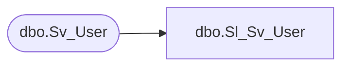

# dbo.Sl_Sv_User

**Database:** fn_01  
**Server:** bedrockdb02  

## Architecture Diagram



## Table Dependencies

| Referenced Table |
|---|
| dbo.Sv_User |

## View Code

```sql
create view  [dbo].[Sl_Sv_User] (
       	user_id, 
       	user_name, 
       	user_fullname, 
       	user_level, 
       	topic_id, 
       	flags, 
       	mail_user_name, 
       	mail_password, 
       	logo_filename, 
       	check_mail_interval, 
       	user_password, 
       	user_status, 
       	email_address, 
       	language_id, 
       	pc_language_id
)
AS SELECT 
       	user_id, 
       	user_name, 
       	user_fullname, 
       	user_level, 
       	topic_id, 
       	flags, 
       	mail_user_name, 
       	mail_password, 
       	logo_filename, 
       	check_mail_interval, 
       	user_password, 
       	user_status, 
       	email_address, 
       	language_id, 
       	pc_language_id
FROM fn_01.dbo.Sv_User
```

