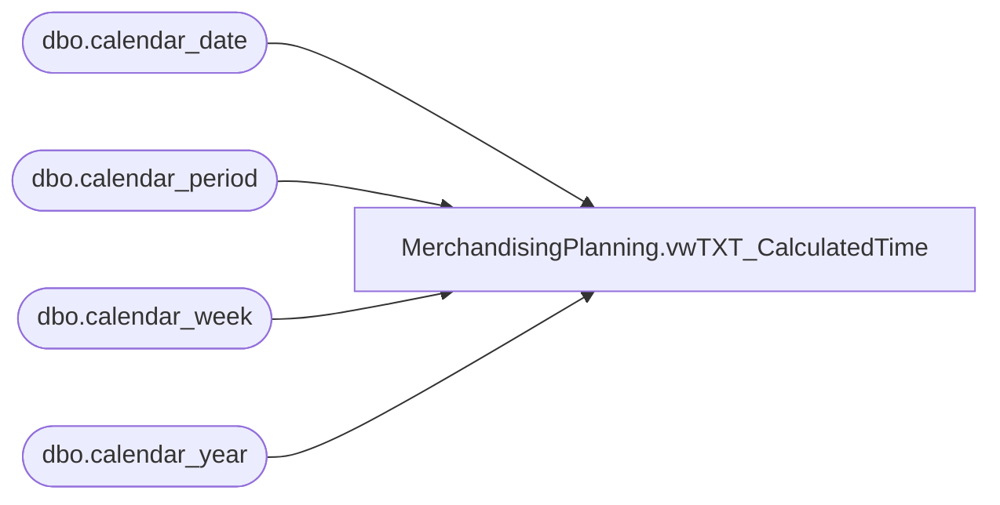

# MerchandisingPlanning.vwTXT_CalculatedTime

**Database:** ma_01  
**Server:** bedrockdb02  

## Architecture Diagram



## Table Dependencies

| Referenced Table |
|---|
| dbo.calendar_date |
| dbo.calendar_period |
| dbo.calendar_week |
| dbo.calendar_year |

## View Code

```sql
CREATE view [MerchandisingPlanning].[vwTXT_CalculatedTime] 


 AS


SELECT 
--CASE WHEN cw.calendar_week_code IN ('1','5','10','14','18','23','27','31','36','40','44','49') THEN '01' 
--     WHEN cw.calendar_week_code IN ('2','6','11','15','19','24','28','32','37','41','45','50') THEN '02' 
--     WHEN cw.calendar_week_code IN ('3','7','12','16','20','25','29','33','38','42','46','51') THEN '03' 
--     WHEN cw.calendar_week_code IN ('4','8','13','17','21','26','30','34','39','43','47','52') THEN '04' 
--     WHEN cw.calendar_week_code IN ('9','22','35','48') THEN '05' 
--     WHEN cw.calendar_week_code IN ('53') THEN '06' 
--END AS WEEK,

CASE WHEN cy.calendar_year_code in (2014) -- Past year with 53rd week
	THEN 
		CASE WHEN cw.calendar_week_code IN ('1','5','10','14','18','23','27','31','36','40','44','50') THEN '01' 
		 WHEN cw.calendar_week_code IN ('2','6','11','15','19','24','28','32','37','41','45','51') THEN '02' 
		 WHEN cw.calendar_week_code IN ('3','7','12','16','20','25','29','33','38','42','46','52') THEN '03' 
		 WHEN cw.calendar_week_code IN ('4','8','13','17','21','26','30','34','39','43','47','53') THEN '04' 
		 WHEN cw.calendar_week_code IN ('9','22','35','48') THEN '05' 
		 WHEN cw.calendar_week_code IN ('49') THEN '06'
	END
ELSE 
	CASE WHEN cw.calendar_week_code IN ('1','5','10','14','18','23','27','31','36','40','44','49') THEN '01' 
		 WHEN cw.calendar_week_code IN ('2','6','11','15','19','24','28','32','37','41','45','50') THEN '02' 
		 WHEN cw.calendar_week_code IN ('3','7','12','16','20','25','29','33','38','42','46','51') THEN '03' 
		 WHEN cw.calendar_week_code IN ('4','8','13','17','21','26','30','34','39','43','47','52') THEN '04' 
		 WHEN cw.calendar_week_code IN ('9','22','35','48','53') THEN '05' 
END
END AS WEEK,
CASE WHEN cd.merch_period = 1 THEN CAST(cy.calendar_year_code AS VARCHAR) + 'FEB' 
	 WHEN cd.merch_period = 2 THEN CAST(cy.calendar_year_code AS VARCHAR)  + 'MAR' 
	 WHEN cd.merch_period = 3 THEN CAST(cy.calendar_year_code AS VARCHAR)  + 'APR' 
	 WHEN cd.merch_period = 4 THEN CAST(cy.calendar_year_code AS VARCHAR)  + 'MAY' 
	 WHEN cd.merch_period = 5 THEN CAST(cy.calendar_year_code AS VARCHAR)  +  'JUN' 
	 WHEN cd.merch_period = 6 THEN CAST(cy.calendar_year_code AS VARCHAR) +  'JUL' 
	 WHEN cd.merch_period = 7 THEN CAST(cy.calendar_year_code AS VARCHAR) +  'AUG' 
	 WHEN cd.merch_period = 8 THEN CAST(cy.calendar_year_code AS VARCHAR)  +  'SEP' 
	 WHEN cd.merch_period = 9 THEN CAST(cy.calendar_year_code AS VARCHAR)  +  'OCT' 
	 WHEN cd.merch_period = 10 THEN CAST(cy.calendar_year_code AS VARCHAR)  +  'NOV' 
	 WHEN cd.merch_period = 11 THEN CAST(cy.calendar_year_code AS VARCHAR) +  'DEC' 
	 WHEN cd.merch_period = 12 THEN CAST(cy.calendar_year_code AS VARCHAR)  + 'JAN'
END AS MONTH,
CASE WHEN cd.merch_period = 1 THEN 'FEB'
	 WHEN cd.merch_period = 2 THEN 'MAR'
	 WHEN cd.merch_period = 3 THEN 'APR'
	 WHEN cd.merch_period = 4 THEN 'MAY'
	 WHEN cd.merch_period = 5 THEN 'JUN'
	 WHEN cd.merch_period = 6 THEN 'JUL'
	 WHEN cd.merch_period = 7 THEN 'AUG'
	 WHEN cd.merch_period = 8 THEN 'SEP'
	 WHEN cd.merch_period = 9 THEN 'OCT'
	 WHEN cd.merch_period = 10 THEN 'NOV'
	 WHEN cd.merch_period = 11 THEN 'DEC'
	 WHEN cd.merch_period = 12 THEN 'JAN'
END AS MONTH_NAME,
CASE WHEN cd.merch_period = 1 THEN 'FEBRUARY'
	 WHEN cd.merch_period = 2 THEN 'MARCH'
	 WHEN cd.merch_period = 3 THEN 'APRIL'
	 WHEN cd.merch_period = 4 THEN 'MAY'
	 WHEN cd.merch_period = 5 THEN 'JUNE'
	 WHEN cd.merch_period = 6 THEN 'JULY'
	 WHEN cd.merch_period = 7 THEN 'AUGUST'
	 WHEN cd.merch_period = 8 THEN 'SEPTEMBER'
	 WHEN cd.merch_period = 9 THEN 'OCTOBER'
	 WHEN cd.merch_period = 10 THEN 'NOVEMBER'
	 WHEN cd.merch_period = 11 THEN 'DECEMBER'
	 WHEN cd.merch_period = 12 THEN 'JANUARY'
END AS MONTH_DESCRIPTION,
min(cw1.calendar_week_start_date) as MONTH_DATE, 
max(cw1.calendar_week_end_date) as MONTH_END_DATE,
cw.calendar_week_start_date as WEEK_DATE,
cw.calendar_week_end_date as WEEK_END_DATE,
cw.calendar_week_code as WEEK_NUMBER,
--cp.calendar_period_code as WEEK_PERIOD,
WEEK_PERIOD = CASE WHEN DATEDIFF(wk,GETDATE(),cw.calendar_week_start_date) < 0 THEN 'WTD' ELSE 'WTG' END,
CAST(cy.calendar_year_code as varchar) + '' + RIGHT ('0' + CONVERT(VARCHAR,cw.calendar_week_code),2) as WEEK_NAME,	
CAST(cy.calendar_year_code as varchar) + '' + RIGHT ('0' + CONVERT(VARCHAR,cw.calendar_week_code),2) as WEEK_DESCRIPTION,	

DATEDIFF(wk,GETDATE(),cw.calendar_week_start_date) as WEEK_PROG,

'BABWALL' as ALL_TIME,								
CASE WHEN cd.merch_period BETWEEN 1 AND 3 THEN cast(cy.calendar_year_code as varchar) + 'QTR1'
	 WHEN cd.merch_period BETWEEN 4 AND 6 THEN cast(cy.calendar_year_code as varchar) + 'QTR2'
	 WHEN cd.merch_period BETWEEN 7 AND 9 THEN cast(cy.calendar_year_code as varchar)  + 'QTR3'
	 WHEN cd.merch_period BETWEEN 10 AND 12 THEN cast(cy.calendar_year_code as varchar) + 'QTR4'
END AS QUARTER,
CASE WHEN cd.merch_period BETWEEN 1 AND 3 THEN 'QUARTER1'
	 WHEN cd.merch_period BETWEEN 4 AND 6 THEN 'QUARTER2'
	 WHEN cd.merch_period BETWEEN 7 AND 9 THEN 'QUARTER3'
	 WHEN cd.merch_period BETWEEN 10 AND 12 THEN 'QUARTER4'
END AS QUARTER_DESCRIPTION,
CASE WHEN cd.merch_period BETWEEN 1 AND 3 THEN 'QTR1'
	 WHEN cd.merch_period BETWEEN 4 AND 6 THEN 'QTR2'
	 WHEN cd.merch_period BETWEEN 7 AND 9 THEN 'QTR3'
	 WHEN cd.merch_period BETWEEN 10 AND 12 THEN 'QTR4'
END AS QUARTER_NAME,	
cy.calendar_year_code as YEAR
FROM	me_01.dbo.calendar_year cy 
		inner join me_01.dbo.calendar_period cp		on cy.calendar_year_id = cp.calendar_year_id
		inner join me_01.dbo.calendar_week cw		on cp.calendar_period_id = cw.calendar_period_id
														and	cp.calendar_year_id = cw.calendar_year_id
														and	cy.calendar_year_id = cw.calendar_year_id
		inner join me_01.dbo.calendar_week cw1		on cw.calendar_period_id = cw1.calendar_period_id
		inner join me_01.dbo.calendar_date cd		on cy.calendar_year_code = cd.merch_year
														and cw.calendar_week_code = cd.merch_week
														and cd.calendar_date = cw.calendar_week_start_date    

GROUP BY 
cw.calendar_week_code, cy.calendar_year_code, cw.calendar_week_start_date, cw.calendar_week_end_date,
cd.calendar_date, cd.merch_period, cp.calendar_period_code
```

