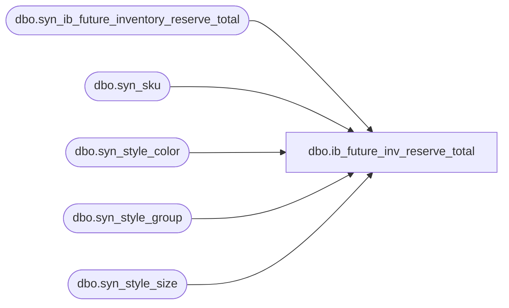

# dbo.ib_future_inv_reserve_total

**Database:** ma_01  
**Server:** bedrockdb02  

## Architecture Diagram



## Table Dependencies

| Referenced Table |
|---|
| dbo.syn_ib_future_inventory_reserve_total |
| dbo.syn_sku |
| dbo.syn_style_color |
| dbo.syn_style_group |
| dbo.syn_style_size |

## View Code

```sql
-----------------------------------------------------------------------------------------------------------------------------
--	Main Query: Create View
-----------------------------------------------------------------------------------------------------------------------------

CREATE VIEW dbo.ib_future_inv_reserve_total

AS

SELECT
	K.sku_id
	,K.style_id
	,SC.color_id
	,SS.size_master_id
	,SG.hierarchy_group_id
	,IFIRT.location_id
	,IFIRT.reserved_quantity reserved_quantity
FROM
	dbo.syn_ib_future_inventory_reserve_total IFIRT
INNER JOIN dbo.syn_sku K ON K.sku_id = IFIRT.sku_id
INNER JOIN dbo.syn_style_color SC ON SC.style_color_id = K.style_color_id
INNER JOIN dbo.syn_style_size SS ON SS.style_size_id = K.style_size_id
INNER JOIN dbo.syn_style_group SG ON SG.style_id = K.style_id AND SG.main_group_flag = 1

dbo,inventory_price_status_$vw,
create view [dbo].[inventory_price_status_$vw]  	(inventory_price_status_id, description) as
	SELECT	inventory_status_id * 100000 + price_status_id,  
			inventory_status_desc + N'-' + price_status_desc 
	FROM		price_status, inventory_status

dbo,location_status,create view dbo.location_status AS
SELECT     *
FROM   me_01.dbo.location_status
dbo,location_type,create view dbo.location_type AS
SELECT     *
FROM   me_01.dbo.location_type
dbo,merch_group_$vw,

create view dbo.merch_group_$vw as 
select g.*
from hierarchy_group g, hierarchy h
where g.hierarchy_id = h.hierarchy_id 
and h.alternate_flag = 0
and h.hierarchy_type = 1


dbo,min_max_profile,create view dbo.min_max_profile AS
SELECT     *
FROM   me_01.dbo.min_max_profile
dbo,nsb_db_install,CREATE VIEW [dbo].[nsb_db_install] (execution_id, install_id, original_filename, generated_by, executed_by, execution_date, execution_status, application_name) AS SELECT execution_id, install_id, original_filename, generated_by, executed_by, execution_date, execution_status, application_name FROM [dbo].[db_install]
dbo,nsb_db_install_detail,CREATE VIEW [dbo].[nsb_db_install_detail] (execution_id, module_id, object_version_id, object_name, object_type_name, execution_status, error_message) AS SELECT execution_id, module_id, object_version_id, object_name, object_type_name, execution_status, error_message FROM [dbo].[db_install_detail]
dbo,nsb_db_install_module,CREATE VIEW [dbo].[nsb_db_install_module] (execution_id, module_id, module_name, from_release_no, from_build_no, to_release_no, to_build_no, execution_status) AS SELECT execution_id, module_id, module_name, from_release_no, from_build_no, to_release_no, to_build_no, execution_status FROM [dbo].[db_install_module]
dbo,seasonal_index,create view dbo.seasonal_index AS
SELECT     *
FROM   me_01.dbo.seasonal_index
dbo,seasonal_indices_schedule,create view dbo.seasonal_indices_schedule AS
SELECT     *
FROM   me_01.dbo.seasonal_indices_schedule
dbo,seasonal_profile_group,create view dbo.seasonal_profile_group AS
SELECT     *
FROM   me_01.dbo.seasonal_profile_group
dbo,seasonal_profile_item,create view dbo.seasonal_profile_item AS
SELECT     *
FROM   me_01.dbo.seasonal_profile_item
dbo,ssnl_prfl_loc_grp_item,create view dbo.ssnl_prfl_loc_grp_item AS
SELECT     *
FROM   me_01.dbo.ssnl_prfl_loc_grp_item
dbo,style_status,create view dbo.style_status AS
SELECT     [style_status_code] AS [style_status_id],
           [style_status_short_descr] AS [description]
FROM   me_01.dbo.style_status
```

