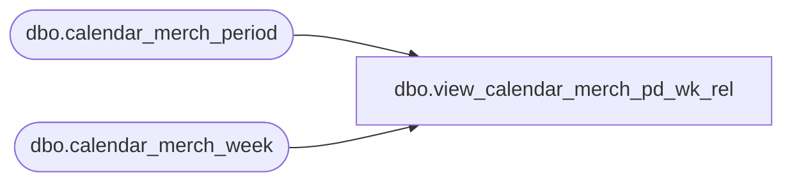

# dbo.view_calendar_merch_pd_wk_rel

**Database:** ma_01  
**Server:** bedrockdb02  

## Architecture Diagram



## Table Dependencies

| Referenced Table |
|---|
| dbo.calendar_merch_period |
| dbo.calendar_merch_week |

## View Code

```sql
create view dbo.view_calendar_merch_pd_wk_rel


as
select (o.merch_year * 100 + o.merch_period)merch_year_pd, (o.merch_year * 100 + o.merch_week)merch_year_wk,
(select count (*) from calendar_merch_period d
                 where (d.merch_year * 100 + d.merch_period ) <= (o.merch_year * 100 + o.merch_period ) ) relative_period
from calendar_merch_week o
```

