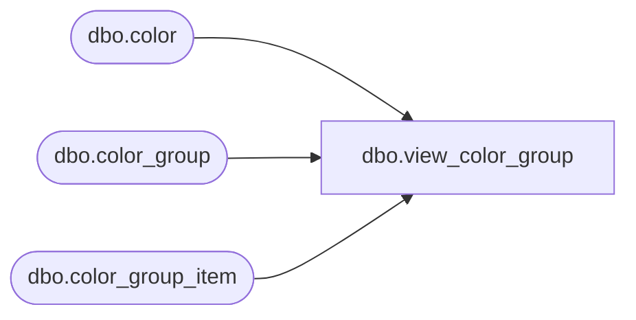

# dbo.view_color_group

**Database:** ma_01  
**Server:** bedrockdb02  

## Architecture Diagram



## Table Dependencies

| Referenced Table |
|---|
| dbo.color |
| dbo.color_group |
| dbo.color_group_item |

## View Code

```sql
CREATE VIEW dbo.view_color_group AS

SELECT c.color_id, cg.color_group_id, cg.color_group_code, cg.color_group_description
FROM color c
LEFT OUTER JOIN color_group_item cgi on c.color_id = cgi.color_id
LEFT OUTER JOIN  color_group cg on cg.color_group_id = cgi.color_group_id
```

