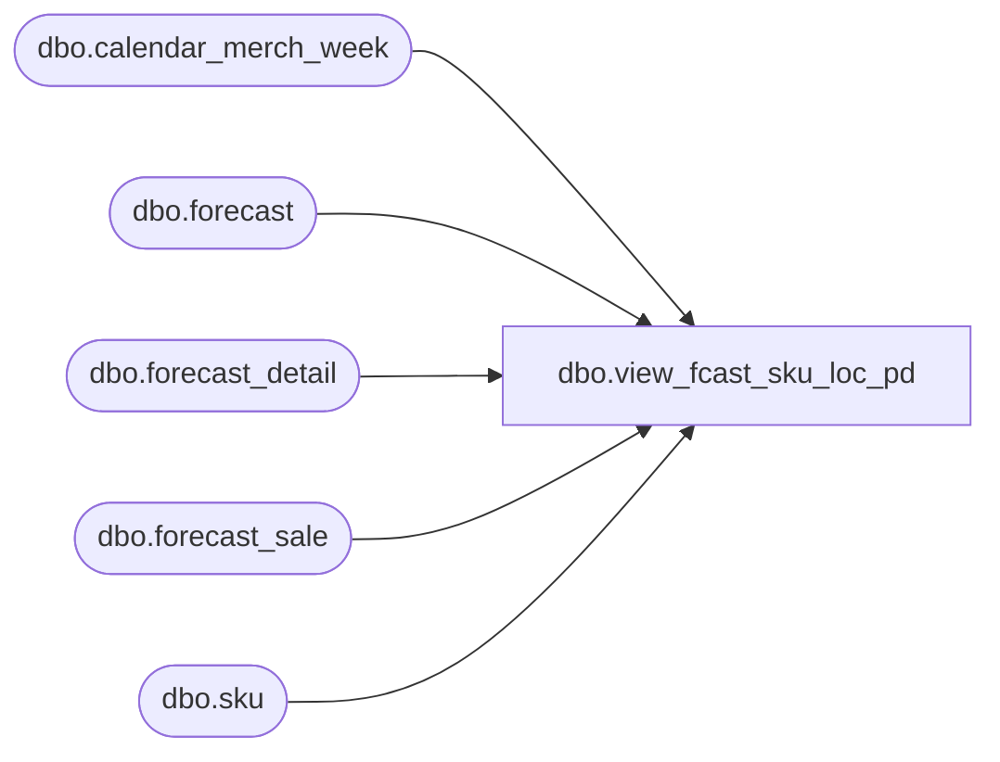

# dbo.view_fcast_sku_loc_pd

**Database:** ma_01  
**Server:** bedrockdb02  

## Architecture Diagram



## Table Dependencies

| Referenced Table |
|---|
| dbo.calendar_merch_week |
| dbo.forecast |
| dbo.forecast_detail |
| dbo.forecast_sale |
| dbo.sku |

## View Code

```sql
CREATE view dbo.view_fcast_sku_loc_pd AS
SELECT DISTINCT  
		c.forecast_id,
		c.forecast_detail_id,
		c.location_id,
		c.forecast_run_date,
		c.style_id,
		c.color_id,
		c.size_master_id,
		c.sku_id,
		(cm.merch_year *100 +cm.merch_period) merch_year_pd,
		SUM(c.adjustment_factor) adjustment_factor,
		SUM(c.forecast_value)forecast_value, 
		SUM(c.forecast_error)forecast_error,
		SUM(c.safety_stock)safety_stock
FROM
(
	SELECT DISTINCT 
		fs.forecast_id,
		fs.forecast_detail_id,
		fd.location_id, 
		b.max_forecast_run_date AS forecast_run_date,
		b.style_id, 
		b.color_id, 
		b.size_master_id,
		b.sku_id, 
		(cw.merch_year *100 +cw.merch_week) AS merch_year_wk,
		fs.adjustment_factor, 
		fs.forecast_value, 
		fs.forecast_error, 
		fs.safety_stock
	FROM forecast f 
	INNER JOIN
	(
		SELECT 
		a.location_id, 
		a.run_date_no_time,
		max(a.forecast_run_date) max_forecast_run_date,
		a.style_id, 
		a.color_id, 
		a.size_master_id,
		a.sku_id 
		FROM 
		(
			SELECT DISTINCT 
				f.forecast_id,
				fd.forecast_detail_id,
				fd.location_id, 
				convert(smalldatetime,convert(varchar, f.forecast_run_date,101)) AS run_date_no_time,
				f.forecast_run_date,
				sk.style_id, 
				sk.color_id, 
				sk.size_master_id,
				fd.sku_id 
			FROM forecast f 
			INNER JOIN forecast_detail fd ON f.forecast_id = fd.forecast_id 
			INNER JOIN sku sk ON fd.sku_id IS NOT NULL AND fd.sku_id = sk.sku_id
		) a
		GROUP BY 
		a.location_id, 
		a.run_date_no_time,
		a.style_id, 
		a.color_id, 
		a.size_master_id,
		a.sku_id 
	) b ON f.forecast_run_date = b.max_forecast_run_date
	INNER JOIN forecast_detail fd ON f.forecast_id = fd.forecast_id AND fd.sku_id IS NOT NULL AND fd.sku_id = b.sku_id AND fd.location_id = b.location_id
	INNER JOIN forecast_sale fs ON fd.forecast_detail_id = fs.forecast_detail_id
	INNER JOIN calendar_merch_week cw ON cw.calendar_week_id = fs.calendar_week_id
) c
INNER JOIN calendar_merch_week cm ON c.merch_year_wk =(cm.merch_year *100 +cm.merch_week)
GROUP BY        
	c.forecast_id,
	c.forecast_detail_id,
	c.location_id,
	c.forecast_run_date,
	c.style_id,
	c.color_id,
        c.size_master_id,
        c.sku_id,
	(cm.merch_year *100 +cm.merch_period)
```

